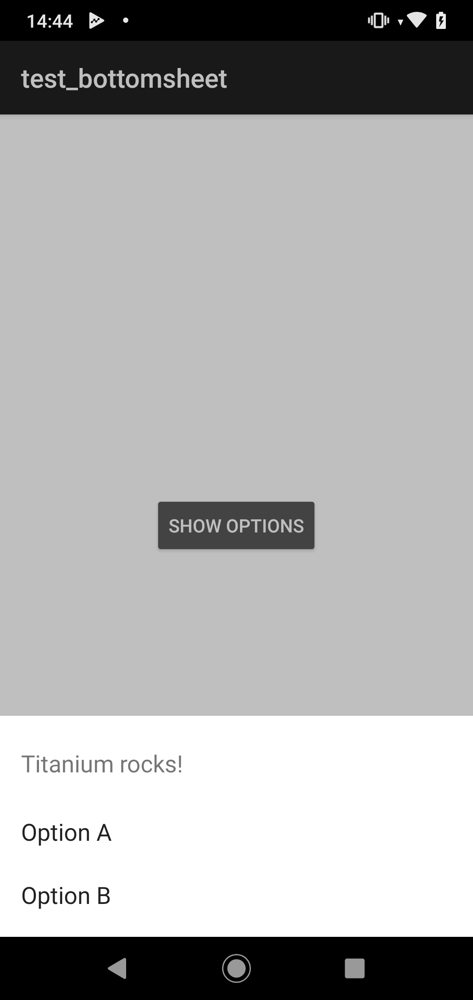

# Titanium Android BottomSheet module

Use the native Android `BottomSheet` view in Appcelerator Titanium.



## Requirements
- [x] Titanium SDK 7.0.0+

## Download
- [x] [Stable release](https://github.com/hansemannn/titanium-android-bottom-sheet/releases)

## API's

### `createOptionDialog`

#### Arguments

| Name | Type |
| - | - | |
| `title` | String |
| `options` | Array<String> |
| `cancelable` | Boolean |

#### Events

##### `click`

| Name | Type |
| - | - | |
| `index` | Number |
| `cancel` | Boolean |

## Examples

```js
import TiBottomSheet from 'ti.bottomsheet';

const options = TiBottomSheet.createOptionDialog({
  title: 'Titanium rocks!',
  options: [ 'Option A', 'Option B' ],
  cancelable: true
});

options.addEventListener('click', event => {
  alert(event);
});

options.show();
```

## Build
```js
cd android
ti build -p android --build-only
```

## Legal

This module is Copyright (c) 2019-present by Hans Knöchel. All Rights Reserved.
